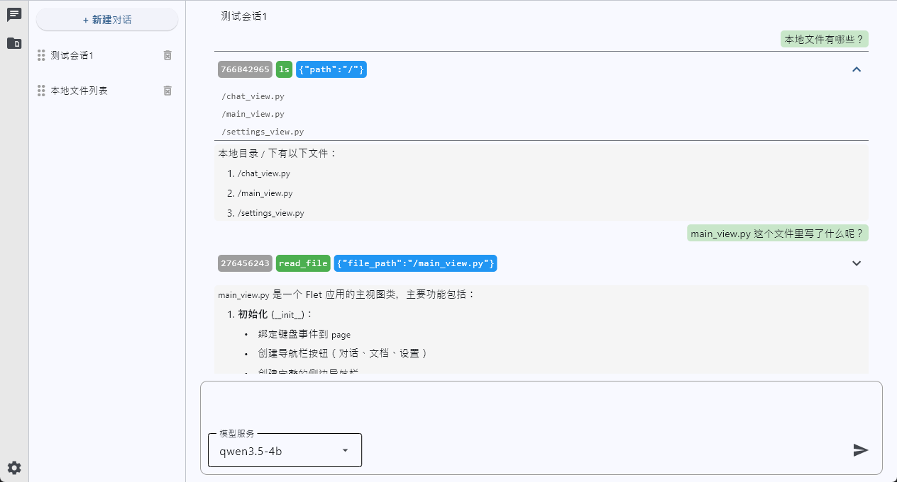
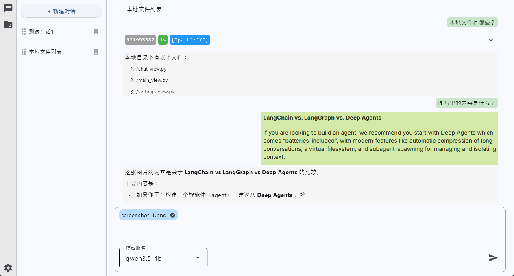
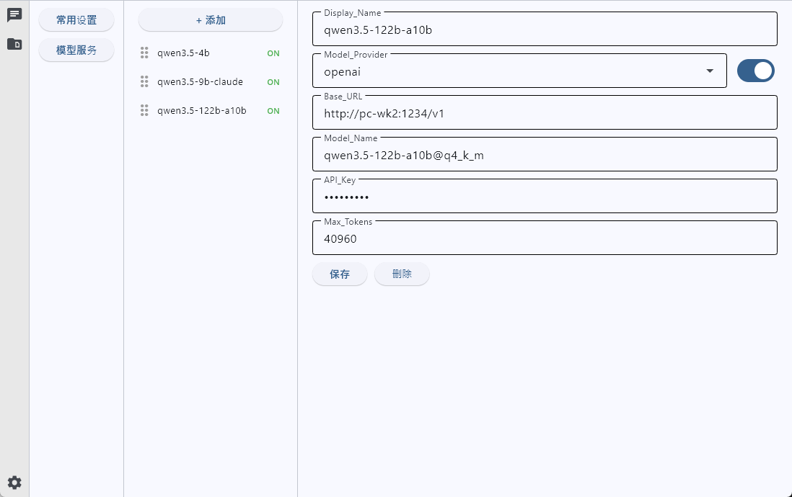

# 软件概述
App-for-DeepAgent 是一个基于 [LangChain/DeepAgents](https://docs.langchain.com/oss/python/deepagents/overview) + [Flet GUI 框架](https://flet.dev/) 开发的纯 Python 应用
- 支持多模态 (可以上传图片, 未来可以继续添加)
- 可以接入任意兼容 openai 和 ollama 类型的 API
- 高度可扩展性, Flet 框架原生为 Python 语言, 可以扩展和对接大量的第三方 Python 库
- 每个对话数据都单独保存为 `json` 文件, 方便转移和备份
- 对话数据均已 `<date>_<uuid[:16]>_<title>.json` 的形式来保存, 方便自行排序和查找

# 环境依赖
```Shell
# Flet 框架
pip install -U 'flet[all]' -i https://pypi.tuna.tsinghua.edu.cn/simple
# LangChain 相关组件
pip install -U deepagents
pip install -U langchain-openai
pip install -U langchain-ollama
# 其余内容
pip install -U PyYAML
pip install -U pillow
```

# 运行命令
```Shell
cd <App-for-DeepAgent>
flet run -r main.py
```

# 运行效果
工具调用

图片输入

设置界面


# 注意事项
1. LangChain 的 OpenAI 不支持 [Non-standard response fields (reasoning_content, reasoning, reasoning_details)](https://docs.langchain.com/oss/python/integrations/chat/openai)
    - 官方结论<br>
        [OpenRouter / LiteLLM / OpenAI API compatibility across providers / proxies](https://github.com/langchain-ai/langchain/issues/34328)
    - 解决办法<br>
        [langchain-openai 无法读取到 qwen3 think 的过程 希望 支持 qwen3 像 支持 deepseek一样（initChatModel）](https://github.com/langchain-ai/langchain/issues/33672)
        ```Python
        # 前往 langchain_openai -> chat_models -> base.py 里找到 _convert_delta_to_message_chunk 这个函数
        if role == "user" or default_class == HumanMessageChunk:
                return HumanMessageChunk(content=content, id=id_)
            if role == "assistant" or default_class == AIMessageChunk:
                ########################################################
                # 在这里添加思考部分的字段内容, 在 langchain-openai v1.1.12 中大概在 430 行左右
                # https://github.com/langchain-ai/langchain/issues/33672
                if _dict.get("reasoning_content") is not None:
                    additional_kwargs["reasoning_content"] = _dict["reasoning_content"]
                ########################################################
                return AIMessageChunk(
                    content=content,
                    additional_kwargs=additional_kwargs,
                    id=id_,
                    tool_call_chunks=tool_call_chunks,  # type: ignore[arg-type]
                )
            if role in ("system", "developer") or default_class == SystemMessageChunk:
                if role == "developer":
                    additional_kwargs = {"__openai_role__": "developer"}
                else:
                    additional_kwargs = {}
                return SystemMessageChunk(
                    content=content, id=id_, additional_kwargs=additional_kwargs
                )       
        ```